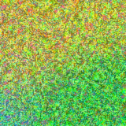
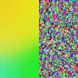
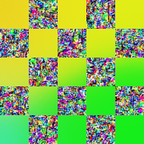
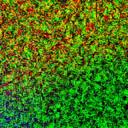

# AIPI-590 - Assignment 9: Adversarial Patches

## Project Overview 

This repository contains the solution for AIPI-590, Assignment 9, focusing on the generation of **Universal Adversarial Patches**.

The goal of this project is to implement the adversarial patch attack against a pre-trained image classifier (specifically **ResNet-34** trained on ImageNet). The resulting patch is designed to be robust and transferable, meaning that when applied to any base image and viewed by the model, it causes the model to misclassify the image as a specific target class (e.g., a "toaster") with high confidence, regardless of the base image's original content.

The core implementation is found in the Jupyter Notebook:
* [`Adversarial Patches .ipynb`](https://colab.research.google.com/github/jessc0202/AIPI-590---XAI-Assignment-9/blob/main/Adversarial%20Patches%20.ipynb)

---

## Getting Started

### Prerequisites

To run the notebook locally or on your own environment, you will need a Python environment with the following dependencies.

* `torch` (PyTorch)
* `torchvision`
* `numpy`
* `matplotlib`
* `Pillow` (PIL)

### Running the Notebook

1.  **Google Colab (Recommended):** The easiest way to run the assignment is to open the notebook directly in Colab:
    * [Open in Colab: Adversarial Patches .ipynb](https://colab.research.google.com/github/jessc0202/AIPI-590---XAI-Assignment-9/blob/main/Adversarial%20Patches%20.ipynb)
    * Ensure your Colab runtime is set to **GPU** for faster patch optimization.

2.  **Local Environment:** Clone the repository and run the `.ipynb` file using Jupyter Lab or a similar environment.

### Setup Steps

Before running the main optimization loop in the notebook:

1.  **Create Image Directory:** Create a folder named `data/images` in the repository root.
2.  **Add Base Images:** Place several example images (e.g., JPG, PNG) into the `data/images` folder. These will be used as the base images over which the adversarial patch is optimized for robustness.
3.  **Run Cells:** Execute the notebook cells sequentially to initialize the model, define helper functions, and begin the iterative patch optimization process.

---

## 📝 Policy on Using AI Resources

In compliance with the course policy, all code snippets generated or modified using resources like ChatGPT, Claude, or Cursor are strictly cited.

---
## Results:
| **Patch Variable** |                       **Type & Source** | **Result**                                                                                                                                                                               |
| ------------------ | --------------------------------------------------------------------: | ------------------------------------------------------------------------------------------------------------------------------------------------------------------------------------------------------- |
|  |   **Baseline / Control Patch** (initial random noise or simple pattern)`learned_pil`| Nematode |
|      | **Robust Adversarial Patch** (output of the optimization loop)`direct_pil `| Bubble                                                                        |
## Blended Patch Results

Below are the blended patches created.

- **combined_blend_50.png** — 50/50 blend of `learned_pil` and `direct_pil`.
  

- **combined_toaster70.png** — 70% `direct_pil` (toaster-dominant) blended with `learned_pil`.
  

- **combined_half_lr.png** — left half from `learned_pil`, right half from `direct_pil`.
  

- **combined_checker.png** — checkerboard mix (e.g., 32×32 tiles) alternating patches.
  

- **combined_multiply.png** — element-wise multiply blend (pixel_A * pixel_B).
  

